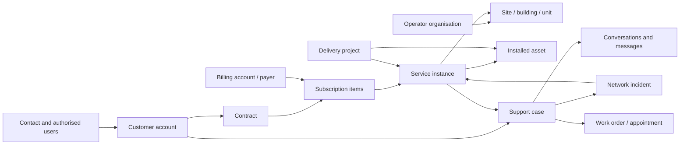
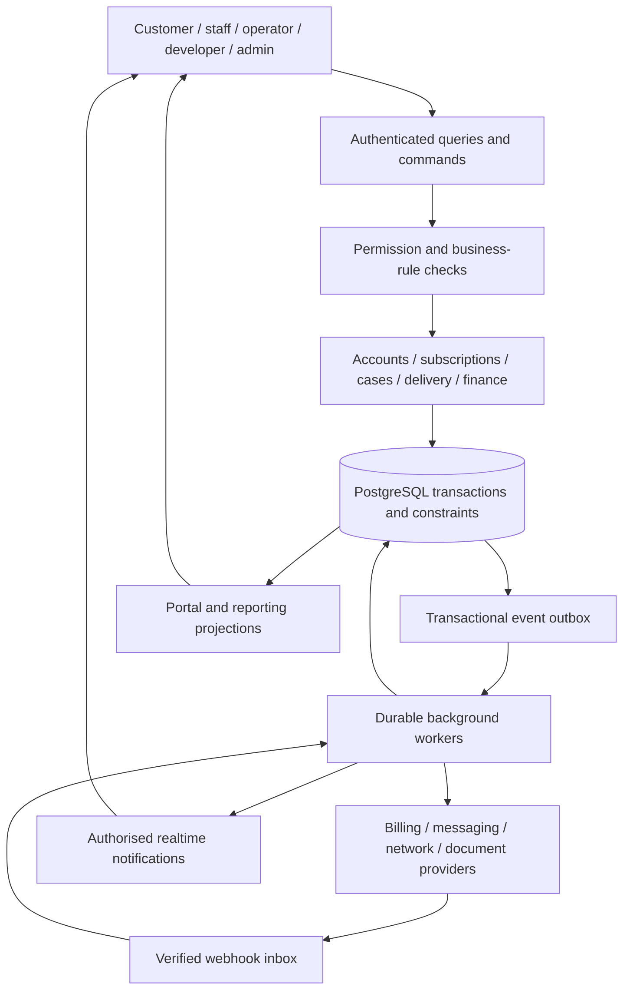

# Acsess Health — Enterprise CRM master plan

Prepared 9 September 2026. Planning deliverable; application code and database have not been changed.

## 1. Recommendation and business understanding

Build an integrated Acsess operating platform with a customer portal, employee service console, operator workspace, developer project workspace, and super admin console. All experiences should use the same account, service, case, and activity records, with different permissions and interfaces.

Acsess is an Australian telecommunications and technology provider that designs, installs, operates, and supports infrastructure for retirement villages, aged care, hospitals, and healthcare communities. Its services span village internet and Wi-Fi, television and MATV/Foxtel, telephone, DAS/mobile coverage, thermal safety, access technology, and SWITCH STAR physical products. The commercial promise is continuity: one provider from design through ongoing support.

This makes the platform a combination of relationship management, subscription operations, service desk, infrastructure operations, field service, and project delivery. Its central design must represent the relationships between residents, paying accounts, operator organisations, villages, dwellings, and equipment.

The most important distinction is **the service user, the payer, the account owner, and the installation location can be different entities**. A resident might use an operator-funded connection, have a separately billed telephone plan, and authorise a family member to handle support. A village operator may own infrastructure contracts without being entitled to see private resident billing or messages.

The supplied context document is the baseline for business intent. Current code is the evidence for implementation status. In particular, the document describes an eight-hour SWITCH STAR cut-off, 10A × 2, and white/black finishes; contradictory fallback copy in the application needs business review, not automatic adoption into the product catalogue.

**Success means:** a customer can understand their subscription and get help; the employee can resolve that issue with the full permitted context; company management can control staffing, contracts, money, and service performance; every state change is consistent and traceable.

## 2. Evidence and present implementation

Reviewed the project context DOCX, public page journeys, account/staff/operator/developer/admin route implementations, shared portal components, authentication and server functions, package configuration, and all three committed SQL migrations. This is a repository review, not a penetration test or verification of the deployed database. Live policies, storage configuration, hosting, existing production data, and third-party integrations still need inspection during discovery.

| Area | What exists in the repository | What the enterprise version needs |
|---|---|---|
| Public website | Company story, service catalogue/details, retirement living, SWITCH STAR, resources, support and enquiry journeys | Consistent approved content, reliable enquiry intake, qualification, service availability, status and knowledge integration |
| Identity | Sign-in/signup/reset, Google flow, profiles, four database roles, organisation membership | Verified account linking, delegated access, employee lifecycle, granular permissions, MFA and session controls |
| Customer services | User-linked records containing plan text, monthly price, status, location and start date | Accounts, contracts, versioned prices, subscriptions, service instances, billing state and change orders |
| Support | Ticket list, stored messages, staff replies and simple status changes | Working ticket creation/reply flow, ownership, queues, SLA clocks, internal notes, real-time chat, escalation and resolution |
| Employee customers | Searchable profile/service list | Full customer record, authorised account actions, tasks, contact history, documents and approvals |
| Operator portal | Sites and site-linked ticket lists | Building/unit hierarchy, scoped incident visibility, portfolio reporting, resident onboarding and contract coverage |
| Developer portal | Site lists displayed as projects and progress paths | Actual project/milestone records, dependencies, approvals, variations and handover |
| Administration | Role toggle UI, organisation list, content visibility switches | Employee management, policy configuration, catalogue/pricing, subscriptions, finance approvals and integrations |
| Platform operations | React/TanStack Start, TypeScript, Supabase clients and RLS migrations | Transactional command layer, job processing, audit history, monitored integrations and tested recovery |

The context says Vite 7; package.json currently specifies Vite 8.1.5. Use the checked-in dependency state as the implementation baseline and review the lockfile/build during delivery.

### Findings that should be resolved before a real customer pilot

These findings are from source inspection; their presence in the deployed environment has not been verified.

| Priority | Finding | Required outcome |
|---|---|---|
| P0 | `ensureDemoAccounts` contains privileged account creation, password reset and staff-role assignment with no authentication/environment guard in the handler. No current caller was found. | Remove it from production build exposure; isolate demo provisioning to nonproduction tooling. Verify whether the deployed handler or demo accounts exist before assessing exposure. |
| P0 | Customer ticket RLS permits whole-row updates to an owned ticket, without business-field restrictions. Insert/update policies do not validate the supplied site relationship. | Enforce permitted commands and authorised account/site/service relationships; customers cannot set staff-owned workflow fields. |
| P0 | Message policies check customer ownership but do not prevent a supplied `is_from_acsess` value or misleading author label. | Derive identity and message origin on the server; immutable author identifiers and explicit visibility. |
| P0 | Customer reply inserts omit `user_id`, while the committed insert policy requires it to equal `auth.uid()`. | Correct the command path and prove customer replies persist under the actual database policies. |
| P0 | “New Request” only sets unused `isNew` state; there is no rendered creation form or ticket insert in that route. | Complete ticket creation end to end, including reference, routing, confirmation and error recovery. |
| P0 | `submitEnquiry` returns success even when database insertion fails. | Confirm success only after durable capture; expose a useful retry/error state. |
| P0 | Operational status is hardcoded to “All Systems Operational.” Open-ticket counts use limited recent lists; “Closed Today” counts all closed tickets loaded. | Use separately defined aggregates, real monitoring/incident evidence and explicit unknown/stale states. |
| P0 | Operator policy can read entire tickets attached to its sites, without a resident-private/site-shared classification. | Define and enforce operator-visible case fields and explicitly shared communications. |
| P1 | Admin UI offers a `developer` role absent from the committed enum; project access actually uses organisation kind. | Replace inconsistent role handling with explicit permission and membership design. |
| P1 | Content/organisation management policies exist, but committed grants explicitly give authenticated users only SELECT on several such tables. | Verify effective live grants; grant only what the final command design needs. RLS policy alone does not confer SQL privileges. |
| P1 | Staff/admin queries use identity-independent cache keys and sign-out does not explicitly clear the query cache. | Scope caches to authenticated identity and active workspace; purge them and subscriptions on account changes. Test shared-browser role changes. |
| P1 | Search, notification and mobile menu controls in the portal header are not wired to complete workflows; access-denied UI includes debug data. | Implement the controls, remove production debug content, and verify keyboard/mobile use. |
| P1 | Fallback content contradicts product specifications and support hours and can reintroduce content when live published results are empty. | Use approved, versioned content; honour unpublishing and distinguish empty results from outages. |

The third migration already revokes some helper-function execution privileges. Recheck effective grants and the security advisor rather than assuming the document's older warning remains unchanged.

## 3. What to take from Salesforce

Adopt the operational patterns that make a CRM useful: related records, ownership, work queues, stage transitions, permission sets, audit history, approvals, saved views and contextual actions.

| Reference pattern | Acsess implementation |
|---|---|
| Accounts and related records | Resident/household and organisation accounts linked to contacts, sites, subscriptions, assets and cases |
| Service console | Multiple open records, ticket split view, activity history, knowledge and actions within the same workspace |
| Routing and service commitments | Queues, skills, capacity, priority, business hours, response/resolution milestones and escalation |
| Self-service portal | My subscriptions, invoices, service status, requests, chat, knowledge and authorised representatives |
| Opportunity and quote flow | Village enquiries, site surveys, opportunities, quote revisions, acceptance and delivery handoff |
| Field service | Work orders, appointments, equipment history, technician evidence and maintenance |
| Sharing and permissions | Role capabilities combined with record scope and field/message visibility |

Salesforce documents service consoles, queues, routing and self-service as connected service capabilities. This is the reference for the operating model, not a claim that the existing site already provides them. [Salesforce service setup](https://help.salesforce.com/s/articleView?id=service.support_admins_intro.htm&language=en_US)

Its quote workflow connects proposed product/service pricing to opportunities; Acsess should use that relationship for village infrastructure sales. [Salesforce quotes](https://help.salesforce.com/s/articleView?id=sales.quotes_overview.htm&language=en_US&type=5)

Its work-order model links account, contact, asset and priority, which fits Acsess installation and maintenance work. [Salesforce work orders](https://trailhead.salesforce.com/content/learn/modules/field_service_maint/field-service-generate-work-orders)

Salesforce distinguishes what a user may do from which records they can see. Acsess needs both controls. [Salesforce sharing considerations](https://help.salesforce.com/s/articleView?id=platform.security_sharing_considerations.htm&language=en_US&type=5)

Target enterprise quality for Acsess's workflows. Reproducing the entire Salesforce product ecosystem is a different, much larger programme. During discovery, compare continuing the custom platform with buying/configuring a CRM and retaining this customer experience as a portal. Evaluate existing systems, total ownership cost, workflow fit, integrations, portability and staffing. The architecture below assumes the custom route remains preferred; that is a planning assumption, not a vendor procurement decision.

## 4. Experiences and navigation

| Experience | Main navigation | Default landing view |
|---|---|---|
| Customer `/account` | Overview, Subscriptions, Bills, Support, Appointments, Documents, Profile & access | Current services, next bill, active request, relevant incident and clear help actions |
| Employee `/staff` | My work, Cases, Live chat, Accounts, Contacts, Subscriptions, Sites & assets, Work orders, Knowledge, Reports | Assigned work, overdue actions, live chat availability, upcoming appointments |
| Operator `/operator` | Portfolio, Sites, Service health, Requests, Resident connections, Contracts, Documents, Reports | Affected villages, service availability and actions awaiting the operator |
| Developer `/developer` | Projects, Milestones, Approvals, Variations, Documents, Handover | Delivery dates, risks and approvals due |
| Super admin `/admin` | Company overview, Employees, Teams & access, Accounts, Catalogue & pricing, Subscriptions, Service operations, Approvals, Integrations, Audit, Content, Settings | Operational exceptions, financial exceptions, staffing and pending approvals |

Use one identity with a workspace switcher populated by actual access. A role selector on a login screen can suggest a destination but cannot grant privileges. Preserve valid deep links through authentication.

### Customer portal

- Subscription detail shows service address/unit, included features, active plan and price version, billing cadence, payer, start/renewal/end dates, contract terms, upcoming changes, related equipment and support history.
- Show service operation separately from subscription status: an active subscription may currently have a network fault. Show data freshness and the source of health information.
- Allow eligible customers to request plan changes, cancellation, move-out or relocation. Show the effective date and any calculated charge before confirmation; fulfilment can remain pending until approved and provisioned.
- Bills show invoice lines, payments, credits, outstanding balance and hosted payment-method management. If the operator pays, say “Included through your village agreement”; do not show another party's invoices.
- Each request has a reference, plain-language status, assigned team, next update expectation, conversation, attachments, appointment and resolution history.
- Persistent “Chat with Acsess” entry point from the current subscription or case. Include context automatically, retain it across navigation and offer an asynchronous request/callback when agents are unavailable.
- Customer-accessible documents use verified permissions and expiring access links; profile updates, notification preferences and representative access are separate controls.
- Support family/carer delegates with verified authority, explicit scope, expiry and revocation. A matching surname or village address never grants access.
- Keep a visible phone/callback alternative for residents who cannot use the portal or have lost internet access.

### Employee workspace

- Personal and team queues: assigned to me, unassigned, due soon, overdue, waiting for customer, waiting for supplier, escalated and recently reopened.
- One customer record contains contact/authority information, subscriptions, billing summary, sites, equipment, cases, calls, emails, tasks, appointments, documents and permitted account flags.
- Actions: correct permitted account details, verify a caller, invite a representative, resend a document, request a plan change, create a connection order, book a technician, create a billing dispute, request a credit and record consent.
- Case work: assign/transfer, set permitted priority, respond publicly, add internal notes, link duplicate cases or an incident, request another team, add a task, schedule follow-up and capture root cause/resolution.
- Assignment history identifies the responsible queue and employee. A handoff carries a reason, context and next action.
- Live chat console includes capacity limits, transfer with transcript, customer context, canned replies, supervisor help and wrap-up notes.
- Team leads manage workload, coverage, exceptions, quality review and escalation. Billing staff and field technicians receive specialist views rather than all-purpose administrator access.

### Super admin console

- Invite, activate, suspend and offboard employees; assign teams, managers, skills, queue memberships and permission sets. Suspension blocks new actions and initiates reassignment of open work.
- Manage company settings, sites, commercial accounts, account owners, service catalogue, plan versions, effective prices, contract templates, support commitments and approval thresholds.
- Manage subscriptions through explicit create/change/suspend/resume/cancel/reinstate commands, including reason, effective date and audit history.
- Configure live chat channels, availability, calendars, routing, capacity, offline behaviour and transcript policy. Authorised supervisors can initiate a case-linked chat invitation, join or take over a conversation, with a visible participant event.
- Monitor finance exceptions, overdue cases, incidents, staffing, activation failures, integration failures and pending approvals.
- Publish reviewed website content and notification templates; configure scoped automation rules and feature flags.
- Review audit history and exports. The super admin can govern the system but cannot silently rewrite issued invoices, erase audits or read stored payment credentials.
- Keep a protected recovery process and prevent removal of the last active super admin through ordinary role editing. High-impact financial and access actions require step-up authentication and, where policy requires, a second approver.

### Operator and developer depth

Operators need site/building/unit views, available versus active services, incident impact, maintenance notices, bulk connection requests, contract documents, authorised resident requests and service reports. Portfolio permission does not automatically grant private resident case content.

Developers need project stages, dependencies, milestone owners, survey/design documents, quote variations, delivery risks, approval requests, commissioning evidence and handover acceptance. Use the existing project/milestone concepts instead of deriving project progress from a site's status.

## 5. Enterprise dashboard design

Give employees a working console with persistent navigation, real global search, saved filtered lists, configurable columns, sorting, server pagination, selection and audited bulk actions. Put the work queue above decorative metrics.

Opening a case should create a stable URL and a workspace tab. The main panel shows the record; a side panel shows customer/service context; the timeline and composer stay visible. Provide separate, unmistakable public-reply and internal-note modes. Warn before abandoning unsaved work.

Use compact, readable rows, restrained borders, clear labels, a small number of meaningful charts, Acsess blue and status colour supported by text. Every metric drills into its underlying records with the same filters and date range. Search must search Acsess data and honour permissions; the current “Search Salesforce...” placeholder should become a real Acsess search.

Use a calmer customer interface with larger text and fewer decisions per page. Follow the context's minimum 17px customer body text, generous touch targets, high contrast, visible focus and reduced-motion support. Staff density should be adjustable; no critical task should depend on tiny badges, colour alone, hover menus or clicking an inaccessible table row.

Design loading, empty, error, offline, stale-data and permission-denied states for every record view. Preserve draft messages during recoverable failures. Display actual timezone labels where an appointment or deadline could be misunderstood.

AI, if introduced later, should be a contextual action such as “Draft reply” or “Summarise case.” It should not become the primary dashboard layout or the authority for changing money, permissions or service states.

## 6. Domain model: records and relationships

Use a single Acsess company boundary initially, with explicit customer and partner access scopes. An operator organisation is a customer/partner entity, not automatically a separate SaaS tenant. If future independent companies use the platform, add and enforce the platform-tenant boundary throughout database keys and policies before onboarding them.

| Domain | Core records | Critical relationships |
|---|---|---|
| Identity and access | Users, profiles, employees, teams, roles, permissions, memberships, scoped grants | A login can represent a contact with several account relationships; an employee receives bounded internal access |
| CRM | Accounts, contacts, account-contact roles, relationships, activities, tasks, consent records | Household/resident and organisation accounts exist without requiring every contact to have a login |
| Locations | Organisations, sites, buildings, units, occupancy periods, service points | A person moving out does not transfer their historical private records to the next resident |
| Catalogue | Offerings, plans, plan versions, price versions, availability, entitlement policies | Public marketing pages reference approved commercial offerings but do not define contractual prices |
| Commercial | Contracts, billing accounts, subscriptions, subscription items, change orders | Separate contracting account, payer and beneficiary; each item identifies where the service is delivered |
| Service delivery | Service instances, provisioning orders, supplier references | Commercial acceptance, network activation and billing commencement are separately tracked |
| Billing | Invoice projections, invoice lines, payment references, credit/refund requests, reconciliation exceptions | One authoritative issuer/ledger per record type; issued history is immutable |
| Support | Cases, case participants, assignments, SLA instances, events, resolution records | Cases link to account and optionally service, site, asset, order, incident or project |
| Conversations | Conversations, participants, messages, delivery receipts, attachments | A case may have several conversation sessions/channels; public and internal content have distinct permissions |
| Network operations | Assets, asset relationships, observations, incidents, incident impact, maintenance windows | A failed upstream asset can affect many service instances and customer cases |
| Field service | Work orders, appointments, technician assignments, parts usage, checklists | Field completion evidence feeds the originating case, project or provisioning order |
| Sales and projects | Enquiries/leads, opportunities, quotes/versions, accepted orders, projects, milestones, approvals, variations | Accepted work produces delivery records and ultimately service/asset handover |
| Product commerce | Orders, order items, shipments, installations, warranty/RMA records | SWITCH STAR physical units and warranty history are distinct from recurring connectivity subscriptions |
| Platform | Documents, document grants, notifications, templates, audit events, outbox/inbox, integration mappings, rule versions | Shared infrastructure with explicit owners, access and retention policies |

An illustrative relationship map:

Mandatory database invariants: unique case references; valid account/location associations; one effective price for a given configured price key/time; no invalid state transitions; consistent money currency/precision; no unauthorised cross-account joins; no duplicate external events; and stable external ID mappings. Enforce referential scope with composite keys/constraints where possible, not just application conventions.

Use typed tables for relationships and business states. Reserve JSON for validated provider payloads and genuinely variable metadata. Do not put pricing rules, account permissions or the entire CRM record into unrestricted JSON.

## 7. Backend architecture and command boundary

Retain React, TypeScript and TanStack Start for the application, and evaluate the existing Supabase deployment as the initial PostgreSQL/auth/storage/realtime foundation. Start with a modular backend within one application and a separately runnable worker. Split services only when measured scaling, reliability or ownership needs justify it.

Suggested ownership in code: `src/modules/{identity,accounts,catalogue,subscriptions,cases,conversations,operations,projects,billing}`, `src/server/{commands,queries,policies,integrations}`, and `workers/`. Final folder naming is an implementation decision; the domain boundaries are the requirement. Pages render data and invoke commands rather than owning business workflows.

For privileged/business mutations:

1. Verify the server-side identity, active employee/membership status and session requirements.
2. Parse an explicit input schema; reject unsupported fields.
3. Load the record within the permitted scope and evaluate the operation/field permissions.
4. Check current state, expected record version, authorisations, effective dates and approvals.
5. Atomically write the business change, audit event and outbox event in one database transaction.
6. Return the committed result or a recoverable conflict. Execute external effects asynchronously.

Use transactional database functions or a database transaction-capable repository; sequential Supabase HTTP calls do not make a multi-record transaction. Keep browser direct writes revoked on controlled business tables, otherwise clients can bypass the command rules. Server/RPC operations still validate scope and identity. Narrow security-definer functions require pinned search paths, restricted execute grants and explicit checks.

RLS protects row access, but service credentials can bypass it. Never assume moving a query to a server using an admin client automatically provides customer isolation. Use user-scoped access where practical, and tightly controlled worker/service identities otherwise. [Supabase RLS documentation](https://supabase.com/docs/guides/database/postgres/row-level-security)

Example contracts:

| Command | Important server checks | Durable result |
|---|---|---|
| `createCase(accountId, serviceId?, issue, idempotencyKey)` | Account authority, valid linked service, input limits | Case/reference, initial public message, queue, applicable SLA and event |
| `assignCase(caseId, assigneeId, expectedVersion)` | Transfer permission, scope, employee status, capacity | One owner, history and notification |
| `postMessage(conversationId, body, clientMessageId)` | Current participation, message mode, attachment permission | Server-derived author, ordered persisted message and event |
| `requestPlanChange(subscriptionId, targetPlanVersion, effectiveAt)` | Eligible offer, scope, contract terms, quote acceptance | Change order with pending/applied/failed outcome |
| `requestCredit(invoiceId, amount, reason)` | Finance scope, available amount, approval policy | Reviewable request; provider credit only after required approval |
| `suspendEmployee(employeeId, reason)` | Admin authority, last-admin protection | Access revocation and tracked work reassignment |

Expose reason codes and structured validation errors, not raw database failures. Every request carries a correlation ID. Financial/provider mutations and message sends use idempotency keys. State changes use optimistic versions or transactional locks so two employees cannot both claim the same case or overwrite a plan change.

## 8. Permissions and company governance

Access is the intersection of authenticated identity, active membership, allowed operation, record relationship, field/message classification and current state. A broad role name alone is insufficient.

| Role/persona | Permitted scope and representative actions | Restrictions |
|---|---|---|
| Resident | Own authorised accounts, services, bills and cases | Cannot edit staff assignments, routing, money or internal notes |
| Representative | Explicitly granted support/billing/account scope, for a defined period | No blanket access to every account associated with the resident |
| Operator user | Assigned organisation/site portfolio and explicitly shared service information | No default access to resident-private messages, hardship details or individual bills |
| Developer user | Assigned projects, shared documents, variations and approvals | No automatic post-handover resident access |
| Support agent | Assigned teams/queues/accounts and required service context | Credits, sensitive account changes and role management need additional authority |
| Account manager | Assigned commercial accounts, contacts, opportunities, renewals | Financial/operational actions follow separate permissions |
| Technician | Assigned work orders, equipment and necessary access/contact details | Limited billing and unrelated customer history |
| Billing specialist | Billing accounts, disputes and permitted adjustments | Approval limits; no unrestricted role administration |
| Team lead | Team work, transfers, escalations and quality review | Company-wide access requires a separate grant |
| Super admin | Company governance and authorised operational intervention | Audit, credential and issued-ledger controls remain enforced |

Use classifications such as customer-visible, explicitly operator-shared, internal, and restricted. Apply them to timeline events, messages, fields, attachments, search results, exports and notifications. Splitting hidden information in the UI after fetching it is not an access control.

Audit privileged and financial actions with actor, acting-on-behalf-of identity, target, reason, before/after fields with sensitive values redacted, timestamp and correlation ID. Make audit records append-only to application identities and protect retention/export storage separately. Database-operator tampering needs a stronger independent archive if required; a table named “immutable” is not enough.

Use scoped, time-limited assisted access with a visible banner and audit trail when staff need a customer-view preview. Do not implement invisible impersonation. Review membership changes and representative authority periodically.

## 9. Complete support and live chat workflow

### Customer starts support from a subscription

1. The portal identifies the authorised account, service and location. The customer selects the issue without re-entering known details.
2. Show a relevant confirmed incident or approved troubleshooting article. The customer can still request help.
3. Starting support atomically creates a case and conversation, or explicitly reuses the relevant existing case. A retry returns the existing result rather than duplicating it.
4. Set the owning queue from service/category/site rules and the entitlement policy. Pick an eligible online employee using skills, capacity and priority, with transactional assignment.
5. If no employee can accept within the configured window, keep the case in a visible queue and offer asynchronous messaging/callback. Present a wait estimate only when supported by actual data.
6. The employee sees the customer, service, confirmed incident, previous relevant cases, verification state and SLA deadlines beside the conversation.
7. Public replies persist before delivery acknowledgement. Customer and employee receive authorised updates without refreshing.
8. Internal notes stay out of customer/operator channels. Transfers preserve transcript, participants, case ownership and next action.
9. An unresolved live conversation can end while the case remains open. A returning customer resumes the case through a new session without losing history.
10. Resolution records cause, action, customer-facing explanation and next steps. Customer confirmation or an approved follow-up policy closes the case; reopening records a new event.

### Case lifecycle and rules

`new → triaged → in_progress → waiting_for_customer / waiting_for_supplier / scheduled → resolved → closed`

Waiting states return to `in_progress`. A reopened case returns to triage or its valid previous team with history preserved. Escalation is an independent flag/event, not a replacement for the work state. Duplicate/cancelled outcomes retain references and reasons.

Every state has allowed actors, required fields, allowed next states and clock effects. A customer message can resume waiting work; a customer cannot arbitrarily mark a supplier-dependent repair completed. Resolve only with required evidence and resolution fields. Do not reset elapsed SLA time when a ticket is transferred.

SLA instances capture the effective policy, severity, service entitlement and calendar at creation. Track first human response, next update and resolution separately. An automatic acknowledgement is not a human response. Customer-wait pauses must follow the contract; supplier delays should not silently pause a customer promise. Store UTC timestamps and use configured local calendars, holidays and daylight-saving rules. Confirm whether Acsess intends fixed AEST or local time by region before configuring hours.

### Live chat implementation requirements

Persist messages in the application database; use realtime as delivery infrastructure. Supabase supports separate authorisation for private Broadcast/Presence channels, and its realtime authorisation table does not store application messages. [Supabase realtime authorisation](https://supabase.com/docs/guides/realtime/authorization)

Require conversation membership checks, server-generated authors, client message IDs for deduplication, per-conversation ordering, reconnect catch-up, delivery/read state, bounded attachments, malware scanning and rate limits. Typing and presence are ephemeral. Attachments inherit the conversation's visibility and cannot become public simply because their URL is known.

Do not rely on initial channel authorisation for indefinite access after revocation. Design revocation handling, disconnect/rejoin or topic rotation, and test an already-connected former member. Prefer minimal realtime payloads that trigger a fresh authorised fetch of sensitive content. Use separate customer and internal event channels.

An admin-initiated conversation creates a visible invitation linked to an account/case; the customer can accept while online or receive a permitted notification. Do not silently open a camera/microphone or imply the customer has joined. Configure supervisor participation with visible attribution. Product support messaging and employee-to-employee collaboration have separate audiences.

## 10. Subscription, money and provisioning flows

Represent three independent dimensions:

- Commercial: proposed, accepted, active, cancellation scheduled, ended.
- Provisioning: not requested, queued, in progress, active, failed, suspension pending, suspended, deactivation pending, deactivated.
- Financial: current, payment pending, overdue, disputed or approved arrangement.

An accepted subscription is not proof that the line is working. A failed payment is not by itself permission to disconnect a service.

**New service:** eligibility check → approved quote/offer → accepted terms → subscription/order pending → provisioning request → verified activation → effective subscription item and billing commencement under the contract → customer confirmation.

**Plan change:** select an eligible version → calculate proposed effective date, charges and any credit → record customer acceptance → apply required approval → schedule provider change → verify completion → activate the new item/version → reconcile billing. If provisioning fails, retain the old valid service state and show a failed/pending change. Refund/credit compensation follows the configured billing policy.

**Cancellation/move-out:** validate authority and notice terms → schedule stop date → coordinate provider deactivation and equipment return → final bill/credit from the authoritative system → end occupancy/service relationships → retain permitted historical records. Never expose old occupant history to the next resident or cancel an entire village service because one resident leaves.

**Overdue payment:** ingest failure → reconcile actual balance → notify appropriately → allow dispute/assistance workflow → authorised review of restrictions → provider action only when permitted and confirmed. Protected account workflows belong in the policy model from the start.

Price and plan versions have effective dates and immutable accepted snapshots. Publishing a new price does not retroactively reprice existing contracts. Renewals have notice/acceptance rules, scheduled changes, grace handling and cancellation outcomes. Store amounts as integer minor units or fixed-precision decimals with currency and explicit tax treatment; finance confirms rounding and proration rules.

Keep the current billing/accounting system authoritative if one exists and is retained. If a new platform is selected, choose one owner for invoice issuance, payment state and ledger balances. The CRM mirrors it with external IDs, timestamps and reconciliation status. Do not run two independent invoice or subscription-schedule engines for the same charge.

Signed webhooks enter an inbox with unique provider/event IDs, then process idempotently. Handle out-of-order events by fetching/reconciling provider state or applying version rules. Provider outages create pending operations, retries and a staff exception queue; they must not produce false success.

## 11. Infrastructure, field service and project workflows

**Village incident:** monitoring event or employee report → verified incident and impacted assets → impacted sites/services → priority and owner → permitted customer/operator notifications → linked cases and work orders → update schedule → verified restoration → customer follow-up and root-cause review.

Model many customer cases against one shared incident. A village incident update can inform all affected customers without merging their private conversations. Resolve the incident after restoration evidence; verify case-specific issues before closing every linked request. Deduplicate noisy alarms and distinguish maintenance from faults. Unknown/stale monitoring is its own condition.

**Field visit:** case/order/project needs work → task checklist and skill requirement → appointment offer → customer/operator confirmation → technician dispatch → equipment/work evidence → acceptance → service/case update. Track travel/access notes, parts, serial numbers, warranty and failed access. Offline technician capture is a later feature with scoped local storage and explicit conflict handling.

Safety and access products need asset, installation, maintenance and warranty records. Do not infer that SWITCH STAR has remote telemetry or control from the context. Integrate device status only when the actual hardware/provider supports it. Approved product-specific troubleshooting must account for service dependencies; do not prescribe automatic reboot/disconnection for potentially safety-dependent services without an agreed procedure.

**Sales to delivery:** public enquiry → deduplicated lead/account → qualification → site survey → opportunity → quote versions and approval → accepted scope → project/work orders → commissioning evidence → signed handover → active assets, services and operator support entitlement.

Projects own milestones, dependencies, costs/variations and approval history. Stage changes require evidence rather than a progress percentage calculated from a site's label. On handover, transfer the necessary operational records to the operator and review developer access separately. Future sales capabilities include renewals, expansion opportunities, account plans, forecast categories and approved campaigns.

SWITCH STAR commerce adds physical order fulfilment, delivery, installation, warranty and returns/RMA. It shares accounts and support but should not force every physical product into a recurring subscription model.

## 12. Automation, integrations and configuration

Start with explicit, versioned rules: event → conditions → permitted actions → audit. Examples are case routing, response reminders, renewal reminders, activation checks, failed payment follow-up and technician task creation. Admins can preview a rule against sample records, see who will be affected, publish a version and roll back future execution. Add loop prevention and action limits.

Notifications use an outbox, templates, audience resolution, preferences, deduplication and delivery receipts. Separate necessary service communications from marketing preferences according to the business's approved policy. Notifications should expose only the minimum context and link to authenticated detail.

| Integration | Ownership decision | Failure behaviour |
|---|---|---|
| Existing billing/accounting | Confirm invoice, balance and payment authority | Pending status, reconciliation and finance exception queue |
| Provisioning/carrier systems | Confirm actual service activation authority | Retriable order with manual reconciliation; no invented active state |
| Network monitoring | Confirm asset mapping and health freshness | Stale/unknown health, actionable monitoring alert |
| Email/SMS | Select provider and sender/domain controls | Retry, delivery state, fallback task where appropriate |
| Inbound support email | Match verified sender and thread/case references | Unmatched/unverified intake queue; do not grant access from email address alone |
| Telephony | Add call logging and optional screen-pop after core support | Durable call activity and manual logging fallback |
| Documents/e-sign | Decide signing, version and storage authority | Pending agreement; no premature acceptance |
| Identity/SSO | Confirm employee identity provider if used | Controlled recovery and revocation behaviour |

Choose providers after inspecting the systems Acsess already uses. CRM-owned orchestration and existing specialist systems can coexist through explicit integration contracts. Do not assume a particular payment processor, accounting platform or carrier API is already in place.

## 13. Reliability, security and scale

Create separate development, staging and production environments with synthetic demo data. Isolate credentials and support least-privilege integration access. Review appropriate hosting location, privacy/retention requirements and contractual obligations with the business before production selection; the business name does not establish a need to store clinical records or biometric templates in this CRM.

Use private document storage, scoped uploads, expiring links, access logging and retention by document type. Store provider references rather than raw card data. Restrict sensitive account flags and minimise their inclusion in logs or search. Account deletion must not cascade uncontrolled deletion through financial/support history as some current user-linked records can; use a defined retention/anonymisation process and legal-hold handling where required.

Use bounded server-side pagination, permission-filtered search and indexed account/site/status/owner relationships. Fetch counts through separate aggregate queries; never calculate global totals from the currently loaded page. Start with PostgreSQL search and measured indexes. Add a dedicated search service or reporting store only when scale and functionality warrant it.

Outbox/inbox workers use leases, retries with backoff, dead-letter queues, deduplication and operator replay. Recheck current permissions/policy for delayed sensitive work. Cancellation or offboarding can invalidate an already queued action.

Logs, traces and dashboards should expose API failures, slow queries, job lag, message delivery lag, integration retries, stale health, authentication issues and audit failures. Use correlation IDs across case, command, event and provider request. Protect diagnostic data from customer visibility.

Proposed initial engineering targets, to validate against real volumes and the chosen hosting tier:

| Measure | Proposed acceptance target |
|---|---|
| App availability | 99.9% monthly application target; measure separately from network uptime and support staffing |
| Common list/search API latency | p95 below 500ms on representative indexed data and agreed concurrency, excluding external provider execution |
| Main employee screen readiness | p95 below 2 seconds on the agreed test network/device |
| Live message visibility | p95 below 2 seconds under the pilot load; database catch-up recovers missed realtime events |
| Capacity envelope | Test at 3× measured expected peak users/events plus representative retained history; discovery supplies actual numbers |
| Recovery | Provisional RPO ≤15 minutes and RTO ≤4 hours, subject to backup tier, file backup and tested restoration |
| Data correctness | No duplicate charge or message side effect from retries; complete audit for privileged/financial commands |

These are design targets, not measured performance or customer-facing promises. Restore drills must cover database, documents, configuration and external reconciliation. Alerting needs a named operational owner and an incident runbook.

## 14. Reporting that supports decisions

| Audience | Useful measures |
|---|---|
| Customer | Actual payable amount, next billing date, request status, next update and confirmed service health |
| Agent/team lead | Assigned backlog, queue age, first response, time waiting, SLA risk/breaches, reopen rate, quality review and feedback |
| Operator | Active service instances, connected versus available dwellings, incident duration, affected services, planned maintenance and contract performance |
| Sales/account manager | Qualified pipeline, quotes awaiting acceptance, forecast categories, renewals due and expansion opportunities |
| Company leadership | Recurring revenue, activation funnel, churn, debt/credits, account renewals, service cost, staffing and project risk |

Define each metric's source, calculation, time window, timezone, exclusions and refresh time. Separate recurring revenue from cash collected and invoiced totals. Define churn at account versus subscription level. Use actual activation counts rather than total village dwellings as “connected.” Report project completion from approved milestones. Avoid implying employee performance can be judged solely by fast ticket closure.

Start with curated saved reports and authorised exports; add an admin-configurable report builder after the underlying metric definitions and permission tests are stable. Exports run as scoped jobs with expiry, limits and audit history.

## 15. Migration and rollout

Evolve the running platform through additive migrations and feature flags. Preserve public routes, brand assets and proven components while replacing incomplete operations. Respect the repository's Lovable rule: no rewriting pushed history; deployable commits on the connected branch.

| Current data | Destination and migration rule |
|---|---|
| `profiles` | Contacts plus linked auth identities; keep profile preferences separate from verified account authority |
| `user_roles`, memberships | Map to new scoped roles/grants; separately review privileged users and fix developer membership semantics |
| `organisations`, `sites` | Preserve IDs where practical; add account relationships, buildings/units and structured addresses |
| `customer_services` | Create draft mapped subscription/service records; retain original price/plan text and provenance; review ambiguous payer or plan matches |
| `support_tickets` | Preserve customer-visible references and dates, assign initial owning queues, add proper account/service links and state mappings |
| `ticket_messages` | Preserve message text/time; classify legacy messages conservatively and record uncertain author identity rather than invent it |
| `documents` | Map private storage objects and explicit grants; check existing external links before moving them |
| `enquiries` | Create intake/lead records with disposition and owner; deduplicate by reviewed rules |
| `projects`, milestones | Preserve actual project records and reconcile site-derived progress displays |
| Public catalogue/resources | Reconcile approved source versions, slugs, product specifications and hidden/published status |

Rollout sequence:

1. Inventory live schema, grants, users, files and external IDs; distinguish seeded/demo data from real business data.
2. Take and restore-test a backup, then run repeatable dry-run migrations with discrepancy reports.
3. Backfill new tables with mapping tables and provenance. Quarantine ambiguous records for business review rather than guessing.
4. Reconcile record counts, case threads, account/site links and financial amounts. Establish one writer per domain at cutover; avoid uncontrolled dual writes.
5. Pilot one village/operator and a small employee group. Use synthetic multi-account test cases before real customer invitations.
6. Expand by cohort behind feature flags with support coverage, training, runbooks and adoption feedback.
7. Retire old writes and compatibility reads only after reconciliation and stability gates pass.

Rollback should switch application routes/read paths only when data compatibility is preserved. New customer messages and financial events must be retained during rollback; use forward repair/reconciliation rather than deleting them or reversing already completed provider charges through a database rollback.

## 16. Delivery programme and dependencies

Indicative planning range: **roughly 6–9 months for a substantial first enterprise release**, with a smaller operational pilot earlier. This assumes a dedicated cross-functional team and usable provider integrations. It is not a committed estimate or full Salesforce feature parity. Re-estimate after discovery, provider access and data assessment.

Suggested team: one accountable product/process owner from Acsess, one technical lead, two backend/integration engineers, two frontend engineers, one QA/automation engineer, and fractional product design and platform/security support. People can cover more than one role, but reducing capacity changes the schedule. Include real support agents, billing staff, an operator and residents in weekly workflow validation.

The rough sequence below totals 24–36 weeks if primarily sequential; selected design and implementation tasks may overlap after their dependencies are stable.

| Phase | Indicative duration | Deliverables | Exit gate |
|---|---|---|---|
| 0. Discovery and production baseline | 2–3 weeks | Confirm systems/volumes, audit deployed state, fix P0 blockers, agree process owners, permission matrix, account model and prototype | Approved workflow/data decisions; safe staging; production blockers understood and addressed before pilot |
| 1. Shared CRM foundation | 3–5 weeks | Accounts/contacts/locations, employee/team lifecycle, permissions, command/transaction layer, audit, files, outbox, shared record UI | Cross-account access tests pass; employee changes and account actions are traceable |
| 2. Support and customer pilot | 5–7 weeks | Customer service view, case creation, ownership, states, SLAs, internal notes, live chat, notifications, basic knowledge and employee console | Resident creates request; correct employee accepts/responds; conversation resumes; case resolves; operator-private boundaries pass |
| 3. Subscription and billing operations | 5–7 weeks | Catalogue/versioning, contracts, subscription changes, billing integration, provisioning orchestration, bills and approvals | End-to-end activation/change/cancellation reconciles with provider, including retries and failure handling |
| 4. Village and delivery operations | 5–8 weeks | Incidents, assets, work orders, operator portfolio, actual project milestones/approvals, lead-to-quote handoff, product support | Demonstrated village outage, technician repair and project handover across all affected workspaces |
| 5. Hardening and wider rollout | 4–6 weeks | Load/accessibility/security testing, recovery drills, migration rehearsal, reporting, training and progressive rollout | Signed release checklist, reconciled data, support readiness and operational ownership |

Later increments: advanced sales forecasting, physical-product commerce, inventory, offline technician app, configurable workflow/report designers, enterprise SSO where needed, richer supplier/telephony integrations and optional permission-bound AI assistance.

Budget from work packages and delivery capacity rather than feature-card counts. Include implementation labour, hosting/database/storage, chat and messaging volumes, monitoring/backups, provider charges, migration, training and ongoing ownership. No numeric cost is defensible until volumes, existing systems, team rates and build-versus-buy decisions are known.

## 17. Acceptance scenarios and release gates

Each module needs targeted unit tests for rules, database permission/transaction tests, integration contract tests and complete user journeys. Billing and case routing require failure/concurrency tests, not only a happy-path UI demonstration. The repository currently has no dedicated test script in package.json; add the relevant harness during foundation work.

Required scenarios:

1. Resident A cannot retrieve Resident B's records through direct API calls, guessed IDs, search, attachments, exports, realtime channels or cached views.
2. An operator sees its permitted incident/site summary while private resident messages and billing remain hidden.
3. A representative can perform only the authorised actions; revocation blocks new requests and further sensitive realtime delivery.
4. Two employees claim a case simultaneously; exactly one becomes owner and the other sees a recoverable conflict.
5. A chat message retried after a network interruption is stored once; reconnect retrieves all authorised messages in order.
6. Ending a chat does not close an unresolved case; an offline customer can return to the same case later.
7. Internal notes and restricted attachments never appear in customer/operator payloads or notifications.
8. A price version change leaves existing accepted contracts intact until their effective change policy applies.
9. Duplicate/out-of-order billing events cannot create duplicate charges, credits or inconsistent balances.
10. Provisioning failure leaves a visible pending/failed order and a recoverable subscription state.
11. One village fault connects to multiple cases; restoration does not erase individual unresolved problems.
12. A move-out and new occupant at the same unit do not share historical personal data.
13. Employee suspension removes access and moves unattended work into a monitored reassignment queue; last-admin protection works.
14. SLA calculation handles holidays, daylight-saving transitions, approved pauses, transfers and reopening.
15. Database errors show truthful failures; an empty dashboard does not stand in for a failed query.
16. A resident completes support and bill viewing with keyboard/screen reader and a small mobile screen; a technician can perform the supported field workflow.
17. Migration counts, legacy references and invoice amounts reconcile; a full restore meets the agreed recovery objective.

The first pilot demonstration should follow one complete story: a resident opens their subscription, starts chat, receives a case reference, is assigned to an employee, exchanges a public reply while internal notes remain private, receives any appointment/update, and confirms resolution. A super admin can inspect the staffing, actions and audit record, and an operator sees only explicitly shared site information.

## 18. Decisions to close in discovery

These do not block this plan; they determine final scope, integration choices and estimates.

| Decision | Suggested owner |
|---|---|
| Current CRM, accounting, subscription billing, support inbox, telephony, monitoring and provisioning systems | Operations lead + technical lead |
| Which services are resident-paid, operator-paid, bundled or jointly funded; who can change/cancel each | Commercial + finance |
| Plan catalogue, contract terms, renewal rules, proration, tax, refunds and hardship handling | Finance + service owner |
| Site/unit/resident volumes, employee count, daily cases, concurrent chats and retained history | Operations |
| Support hours/timezones, holiday calendars, after-hours coverage and response commitments | Support lead |
| Exact operator visibility and representative verification process | Operations + privacy/account governance owner |
| Staff teams, assignment rules, specialist skills and approval limits | Support lead + company management |
| Existing supplier APIs, event reliability, sandbox access and source-of-truth boundaries | Integration lead |
| Verified product specifications, approved public claims and available monitoring telemetry | Product/engineering + content owner |
| Hosting region, retention periods, recovery objectives and independent audit requirements | Company management + platform lead |
| Pilot village/operator, resident testers, go-live date, budget and delivery staffing | Programme owner |

## 19. Repository evidence index

- [Business context document](</Users/vivekdutta/Downloads/AcsessHealthDemo /Acsess-Health-Project-Context.docx>) — business model, audiences, existing scope and planned capabilities.
- [Initial schema](</Users/vivekdutta/Downloads/AcsessHealthDemo /supabase/migrations/20260906124551_0124af7d-f4b6-461e-8db1-71ad02197e88.sql>) — roles, user-linked services, tickets, messages, content and ownership policies.
- [Organisation/site schema](</Users/vivekdutta/Downloads/AcsessHealthDemo /supabase/migrations/20260906140031_1e4dcca7-b36b-4cc1-a513-8a0608a2c4bf.sql>) — organisations, sites, projects, staff access and operator ticket scope.
- [Helper privilege migration](</Users/vivekdutta/Downloads/AcsessHealthDemo /supabase/migrations/20260906140101_17744258-8ce7-4cea-8f7e-b1fd81e08fb9.sql>) — existing hardening changes.
- [Customer support](</Users/vivekdutta/Downloads/AcsessHealthDemo /src/routes/account.support.tsx:19>) — unused creation state and reply insertion.
- [Staff queue](</Users/vivekdutta/Downloads/AcsessHealthDemo /src/routes/staff.index.tsx>) — present status/reply workflow and limited metrics.
- [Customer overview](</Users/vivekdutta/Downloads/AcsessHealthDemo /src/routes/account.index.tsx:29>) — limited recent-ticket query and unconditional health message.
- [Admin people](</Users/vivekdutta/Downloads/AcsessHealthDemo /src/routes/admin.people.tsx:14>) — role UI/schema mismatch.
- [Developer overview](</Users/vivekdutta/Downloads/AcsessHealthDemo /src/routes/developer.index.tsx>) — site-derived project display.
- [Portal shell](</Users/vivekdutta/Downloads/AcsessHealthDemo /src/components/site/PortalShell.tsx>) — shared access/rendering, header controls, record/table components.
- [Demo provisioning handler](</Users/vivekdutta/Downloads/AcsessHealthDemo /src/lib/demo-accounts.functions.ts:10>) — privileged demo setup requiring production isolation.
- [Content and enquiry functions](</Users/vivekdutta/Downloads/AcsessHealthDemo /src/lib/content.functions.ts>) — conflicting fallbacks and success handling.

Recommended first implementation package: address the production blockers, settle accounts/payers/service relationships, establish scoped permissions and transactional commands, then deliver the complete customer-to-agent support story. Those foundations make subscription, finance, operations and sales expansion coherent.
